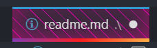

# VS Code Custom CSS Snippets

This repository aims to provide a shared list of possible CSS customization of VS Code with the [vscode custom css extension](github.com/be5invis/vscode-custom-css). This allows simpler sharing of themes and keeping multiple machines in sync. Feel free to create a similar repo for your own or create a PR if you want to share your custom css.

## Usage

1. Install the [vscode custom css extension](github.com/be5invis/vscode-custom-css)
2. Add links to css files to your settings

```json
"vscode_custom_css.imports": [
    "file:///local_css_files",
    "https://global_css_file"
],
```

3. Reload Custom css while connected to the Internet

## Examples

```json
"vscode_custom_css.imports": [
    "https://raw.githubusercontent.com/Buckwich/vscode-custom-css-snippets/master/tab-active-purple-glow/custom.css",
    "https://raw.githubusercontent.com/Buckwich/vscode-custom-css-snippets/master/tab-active-gradient-underline/custom.css",
    "https://raw.githubusercontent.com/Buckwich/vscode-custom-css-snippets/master/tab-dirty-red-stripes/custom.css"
],
```

It is possible to combine multiple effects, for example the three files above result in the following (tab with unsaved changes):


